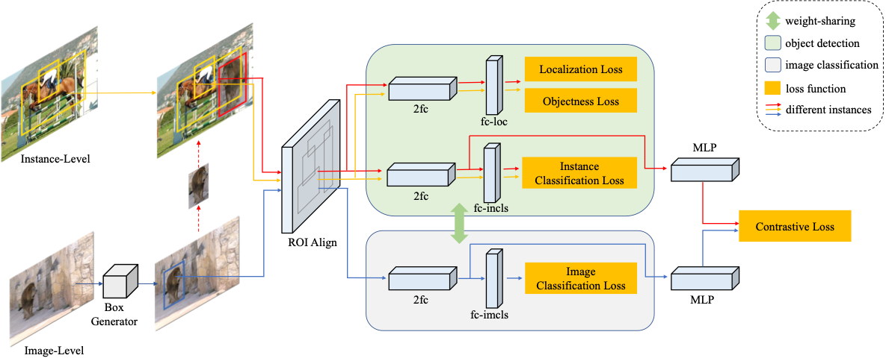

# Improving Long-tailed Object Detection with Image-Level Supervision by Multi-Task Collaborative Learning

Code of CLIS based on [MMdetection](https://github.com/open-mmlab/mmdetection) framework will be coming as soon as possible. Data of the pre-defined region of the ImageNet-22k is provided in the data dictionary.
